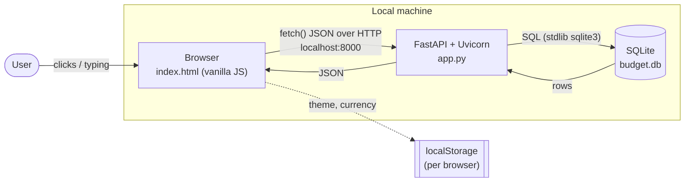
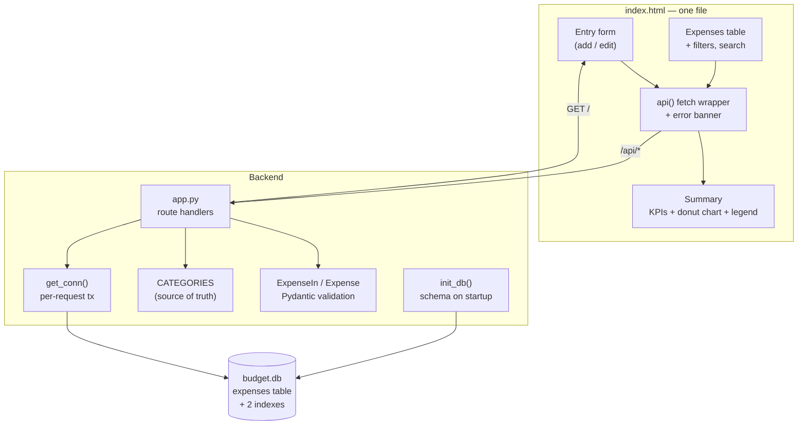
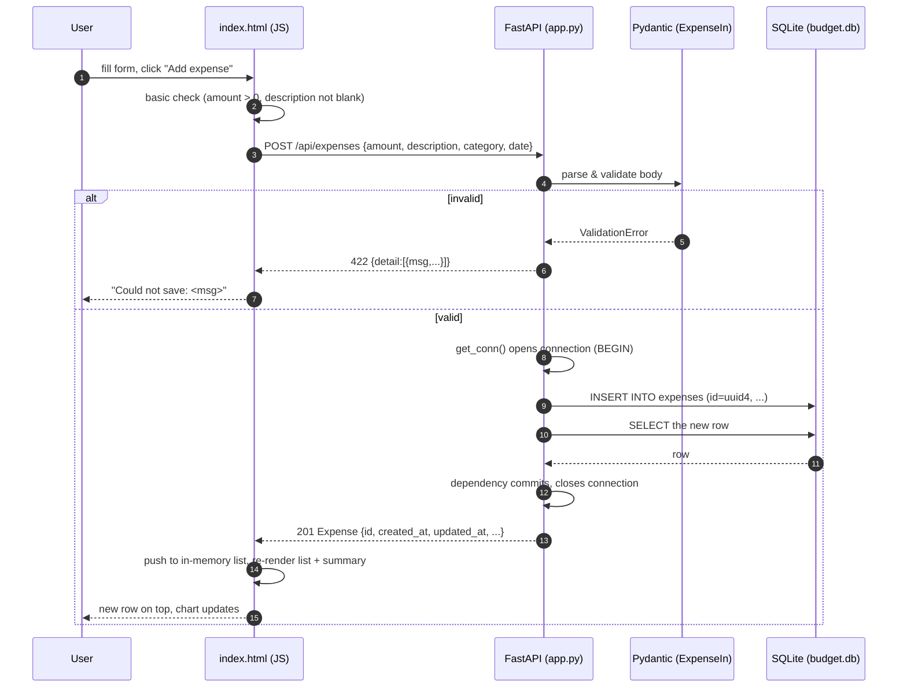
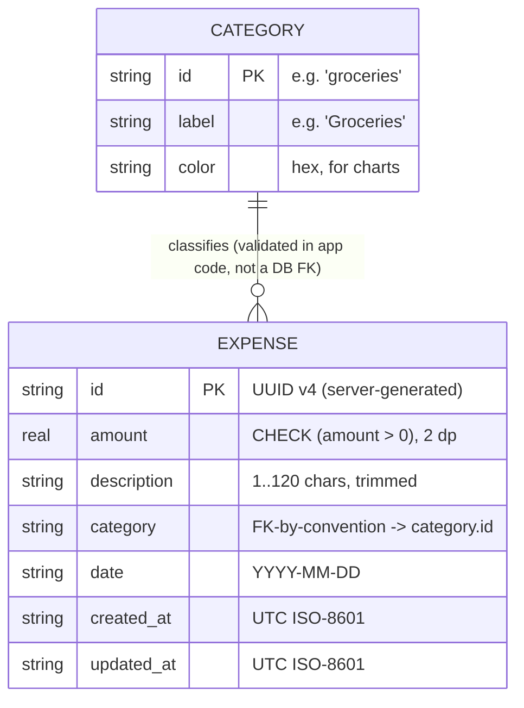
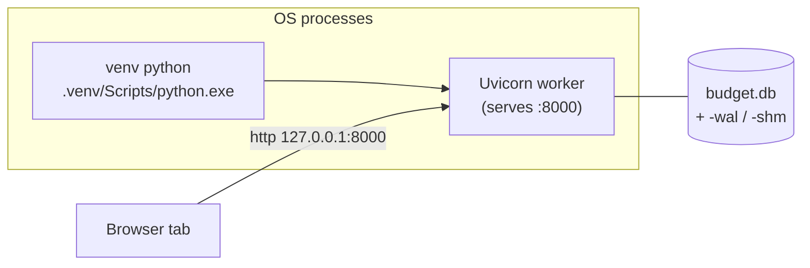

# Budget Tracker — Architecture

- **Status:** reflects code as of 2026-09-03 (API v1.0.0)
- **Style:** single-user local web app — static front end + thin Python API + embedded SQL database

---

## 1. Overview

```
        ┌────────────────────────────────────────────────────────────────┐
        │                        Your computer                           │
        │                                                                │
        │   ┌───────────────┐        HTTP/JSON        ┌───────────────┐   │
        │   │   Browser     │  ───────────────────▶   │  FastAPI app  │   │
        │   │  index.html   │  ◀───────────────────   │   (app.py)    │   │
        │   │  (HTML/CSS/JS)│      localhost:8000     │  + Uvicorn    │   │
        │   └───────────────┘                         └───────┬───────┘   │
        │      localStorage:                                  │ sqlite3   │
        │      theme, currency                                ▼           │
        │      (UI prefs only)                        ┌───────────────┐   │
        │                                            │   budget.db    │   │
        │                                            │ (SQLite file)  │   │
        │                                            └───────────────┘   │
        └────────────────────────────────────────────────────────────────┘
```

The Python process does two jobs: it **serves the front end** (`GET /`) and it
**is the API** (`/api/*`). Because both come from the same origin, no CORS is
needed for the bundled UI. All durable data is in `budget.db`; the browser only
keeps cosmetic preferences.

### Mermaid — system context



---

## 2. Components

### Mermaid — components & responsibilities



| Component | File | Responsibility | Notes |
|-----------|------|----------------|-------|
| Web UI | `index.html` | Render screens, collect input, call the API, draw the donut chart (inline SVG) + legend | No framework, no build step, no external JS/CSS |
| `api()` wrapper | `index.html` (JS) | One place for `fetch`, JSON encode/decode, error-message extraction, connection banner | Turns non-2xx into thrown `Error` with a readable message |
| Route handlers | `app.py` | Map HTTP verbs/paths to DB operations; set status codes | `list/create/update/delete_expense`, `list_categories`, `health` |
| Validation models | `app.py` (`ExpenseIn`, `Expense`) | Enforce field rules before any SQL runs | Pydantic v2 `field_validator`s |
| Category taxonomy | `app.py` (`CATEGORIES`) | Single source of truth for category id/label/colour | Served at `/api/categories`; also used to validate input |
| DB access | `db.py` (`connect`, `get_conn`) | Open a connection per request, `Row` dicts, FK + WAL pragmas, commit/rollback | `get_conn` is a FastAPI `yield` dependency |
| Schema bootstrap | `db.py` (`init_db`, `SCHEMA`) | Create table + indexes if missing | Called from the app's `lifespan` startup |
| Database | `budget.db` | Durable storage | One file; path overridable via `BUDGET_DB` |

---

## 3. Request lifecycle

### Mermaid — create an expense



**Edit** and **delete** follow the same shape: the JS calls
`PUT /api/expenses/{id}` or `DELETE /api/expenses/{id}`, the handler checks the
row exists (`404` if not), performs the write inside the per-request
transaction, and the front end updates its local array from the response.

**Startup:** Uvicorn imports `app.py` → `lifespan` runs `init_db()` →
`CREATE TABLE IF NOT EXISTS` + indexes → app ready.

---

## 4. Data model

### Mermaid — ER



- `CATEGORY` is **not a table** — it is a constant list in `app.py`. `expense.category`
  is validated against it on write. This keeps colours/labels in one place and
  avoids a migration every time the list changes, at the cost of no
  referential integrity in the database itself.
- **Indexes:** `idx_expenses_date(date)` and `idx_expenses_category(category)`
  support the list filters and the "this month" / per-category summaries.
- **Pragmas:** `journal_mode=WAL` (concurrent reads while writing),
  `foreign_keys=ON` (ready for future real FKs).

### DDL (from `db.py`)

```sql
CREATE TABLE IF NOT EXISTS expenses (
    id          TEXT PRIMARY KEY,
    amount      REAL NOT NULL CHECK (amount > 0),
    description TEXT NOT NULL,
    category    TEXT NOT NULL,
    date        TEXT NOT NULL,
    created_at  TEXT NOT NULL DEFAULT (strftime('%Y-%m-%dT%H:%M:%SZ', 'now')),
    updated_at  TEXT NOT NULL DEFAULT (strftime('%Y-%m-%dT%H:%M:%SZ', 'now'))
);
CREATE INDEX IF NOT EXISTS idx_expenses_date     ON expenses(date);
CREATE INDEX IF NOT EXISTS idx_expenses_category ON expenses(category);
```

---

## 5. Key decisions (and trade-offs)

| Decision | Why | Trade-off / when to revisit |
|----------|-----|------------------------------|
| **SQLite**, not Postgres | Zero install, one file, stdlib driver; fits single-user local use | Not for many concurrent writers or networked multi-user — see [SETUP §7.3](SETUP.md) |
| **API in front of the DB** (not browser-direct) | One integration point for future clients; server-side validation; DB file never exposed to the browser | Requires the server to be running to use the app |
| **Server serves the UI** | Same origin → no CORS for the bundled client; one thing to start | Cross-origin clients must opt in via `BUDGET_CORS` |
| **Vanilla JS, single HTML file** | No build tooling, trivial to read and host, fast | No component model; manual DOM updates |
| **Categories in code** | Labels + colours in one place; no join; no migration to add one | No DB-level integrity; changing the list needs a restart |
| **`amount` as REAL** | Simple; fine for personal tracking | Floating-point rounding; move to integer minor units for strict accounting ([TODO](TODO.md)) |
| **Connection per request** | Simple lifecycle, automatic commit/rollback, thread-safe | A tiny bit of open/close overhead (negligible at this scale) |
| **Full-list responses (no pagination)** | Personal datasets are small; simpler client | Add pagination if datasets grow large ([TODO](TODO.md)) |
| **No auth; bind to 127.0.0.1** | Local personal tool | Must add auth + TLS before any network exposure |

---

## 6. Deployment view

### Mermaid — processes



- **Dev/local (default):** `python app.py` → Uvicorn on `127.0.0.1:8000`,
  single worker, `budget.db` in the project folder. (On Windows a venv adds a
  thin launcher process in front of the worker — one logical server.)
- **Service:** process manager runs the same command with `BUDGET_HOST` /
  `BUDGET_PORT` / `BUDGET_DB` set; optionally behind a TLS-terminating reverse
  proxy that also enforces authentication.
- **Runtime artifacts:** `budget.db`, `budget.db-wal`, `budget.db-shm`,
  `server.out.log`, `server.err.log` — none belong in source control.

---

## 7. Extension points

| You want to… | Touch | Leave alone |
|--------------|-------|-------------|
| Add a field to expenses | `db.py` SCHEMA (+ migration), `ExpenseIn/Expense`, SQL in `app.py`, form + table in `index.html` | API path shape |
| Add an endpoint (e.g. summary aggregation) | new handler in `app.py` | `db.py`, front end (optional) |
| Change categories | `CATEGORIES` in `app.py`, restart | DB schema |
| Use a different database | `db.py` only (keep function names), dialect of SCHEMA | API contract, front end |
| Add auth | dependency in `app.py`; header handling in `api()` wrapper | DB layer |
| Another client (mobile/CLI) | new consumer of the documented API | this repo's server & DB |
